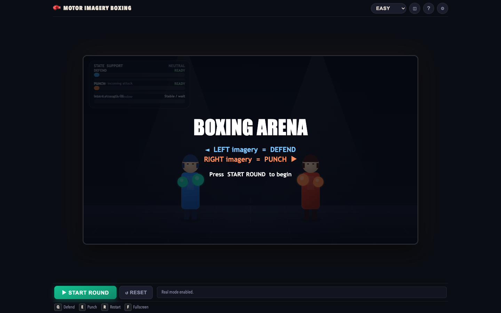
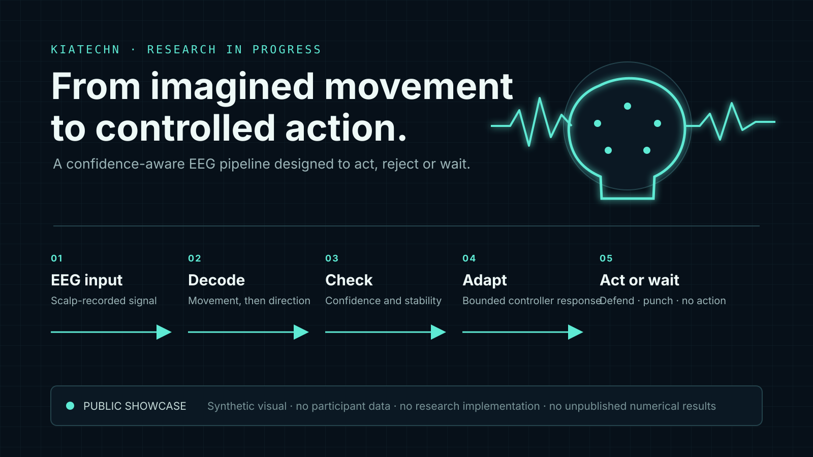
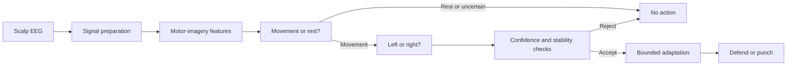

# Adaptive Motor-Imagery BCI

> **Public project overview · research in progress**
>
> This repository is a deliberately limited portfolio copy of an unpublished research project. It shows the problem, system architecture and actual game interface without releasing participant data, implementation code, trained models, exact parameters or unpublished results.

<p align="center">
  
</p>

<p align="center"><em>Actual interface from the private project, captured without participant data, EEG traces, predictions or model output.</em></p>

## At a glance

| Question | Answer |
|---|---|
| What is the problem? | EEG signals change across people and over time, which makes reliable real-time brain–computer control difficult. |
| What did I build? | An end-to-end motor-imagery BCI system that connects EEG processing and machine learning to an interactive boxing task. |
| What does the system do? | It interprets left- or right-hand motor imagery and converts an accepted decision into a defend or punch action. Uncertain decisions can be rejected. |
| What is public here? | A high-level architecture, an actual screenshot of the game, design decisions, evaluation scope, limitations and future work. |
| What remains private? | Participant information and recordings, source code, trained models, exact settings, detailed methods and unpublished numerical findings. |
| Current status | Manuscript preparation and publication review. |

## 1. The rehabilitation and real-time BCI problem

A brain–computer interface (BCI) converts measured brain activity into a computer command. This project uses electroencephalography (EEG), which measures small electrical signals from the scalp without surgery.

The task is **motor imagery**: mentally rehearsing a movement without physically performing it. Imagining left- and right-hand movement can produce different patterns around the brain's sensorimotor areas. A trained model can learn task-specific differences between those patterns; it does **not** read a person's general thoughts.

The real-time challenge is uncertainty. EEG is weak, noisy and variable. A cautious controller may reject too many usable decisions, while an overly permissive controller may cause unwanted actions. This project explores how to make the system responsive while managing that risk.

Motor-imagery BCIs may eventually support engaging rehabilitation exercises or assistive interfaces. This project evaluates decoding and interactive control behaviour; it does not measure patient recovery, claim clinical effectiveness or operate as a medical device.

## 2. What I built

I designed and implemented the complete route from EEG input to application feedback:

1. EEG acquisition and signal preparation;
2. an offline processing and model-evaluation pipeline;
3. a two-stage decision path that first detects movement and then distinguishes left from right;
4. chronological pseudo-live replay to test decisions without using future information;
5. confidence, rejection, persistence and timing logic;
6. a bounded adaptive controller that responds to recent signal behaviour;
7. a game interface that receives defend, punch or no-action commands; and
8. an evaluation workflow for comparing controller behaviour.

The complete implementation and reproducibility materials remain in the private research project while the paper is being prepared.

## 3. System architecture

<p align="center">
  
</p>



The EEG pipeline and game are separated. The interface receives a compact action and controller state; it does not need direct access to raw EEG or participant identity.

## 4. EEG channels and experimental setup

The private system uses non-invasive scalp EEG recorded from sensorimotor regions associated with imagined hand movement. Recordings are organised into labelled task periods so the processing pipeline can learn and evaluate left-hand imagery, right-hand imagery and non-action states.

Exact channel selections, timing windows, recording details and participant procedures are intentionally withheld here because they form part of the unpublished study. No participant photograph, identifier, recording or individual result is included in this repository.

## 5. CSP and SVM pipeline

The processing path combines established motor-imagery methods:

- EEG is prepared for consistent analysis;
- **Common Spatial Patterns (CSP)** emphasises spatial signal patterns that help separate task classes;
- a **Support Vector Machine (SVM)** learns a decision boundary from those features; and
- the resulting evidence is passed to the real-time control layer.

CSP and SVM are established techniques. The project work lies in integrating signal processing, staged decisions, causal evaluation, rejection, adaptation and game feedback as one complete system. Exact feature definitions, preprocessing settings, model parameters and implementation details are reserved for the paper and its future research release.

## 6. Adaptive confidence and rejection controller

The classifier is not forced to act on every estimate. The controller checks confidence and short-term stability before allowing an action. When the evidence is insufficient, the safe output is **no action**.

The adaptation is bounded: it can adjust how readily useful decisions are accepted, but only within controlled limits. This creates an important trade-off. Adaptation can improve useful outcomes and responsiveness, but it can also increase exposure to false activations. Both benefits and costs therefore need to be evaluated together.

The exact adaptation rule, thresholds and timing logic are unpublished and are not included in this portfolio copy.

## 7. Offline, pseudo-live and exploratory live evaluation

| Evaluation layer | What it tests | Public status |
|---|---|---|
| Offline decoding | Whether task-related EEG patterns can be distinguished in held-out evaluation | Completed internally; numerical findings withheld |
| Pseudo-live replay | Whether decisions remain useful when data is processed in chronological order without looking ahead | Completed internally; numerical findings withheld |
| Adaptive comparison | How fixed and adaptive control affect responsiveness, rejection and false-activation risk | Completed internally; statistical analysis withheld |
| Exploratory live integration | Whether incoming EEG can travel through the system and produce game feedback | Engineering pathway demonstrated; participant evidence withheld |
| Clinical rehabilitation | Whether the system improves patient or functional outcomes | Not evaluated and not claimed |

## 8. Results and trade-offs

The internal evaluation indicates that adaptive control changes the balance among useful accepted actions, rejected decisions, response time and false activations. It may improve useful outcomes while also increasing false-activation exposure.

That qualitative conclusion is shared here because it is central to understanding the engineering problem. Numerical values, statistical tests, participant-level outcomes and paper figures are withheld until the manuscript and publication strategy are finalised.

## 9. Limitations

- EEG behaviour varies across people, sessions and recording conditions.
- Pseudo-live replay is more realistic than ordinary offline scoring, but it is not a full closed-loop clinical evaluation.
- Exploratory live integration does not establish effectiveness across a clinical population.
- Better responsiveness does not automatically mean safer or more reliable control.
- The boxing task demonstrates system integration, not rehabilitation benefit.
- This portfolio copy is intentionally non-reproducible while the work is unpublished.

## 10. What I would improve next

- complete the manuscript and publication review;
- extend evaluation across more sessions and appropriate participants;
- improve robustness to session-to-session EEG change;
- compare additional confidence and adaptation strategies;
- assess usability, workload and false-activation tolerance in a suitable study;
- add a privacy-reviewed hardware photograph and short demonstration video; and
- prepare a versioned research release if publication, ethics and intellectual-property review permit it.

## 11. How this repository is organised

```text
assets/
  motor-imagery-boxing-preview.png   Screenshot of the actual project interface
  system-overview.svg                High-level EEG-to-action diagram
docs/
  DISCLOSURE_BOUNDARY.md             Rules for keeping the public copy safe
tests/
  test_public_boundary.py            Automated checks for accidental disclosure
.github/workflows/
  public-boundary.yml                Runs the disclosure checks on GitHub
NOTICE.md                            Pre-publication rights and use notice
README.md                            Project case study
```

There is deliberately no runnable game, research source code, model or dataset in this repository. The screenshot demonstrates the interface that was built; it is not a substitute implementation and does not disclose a participant result.

## Privacy and publication boundary

This public overview excludes:

- raw, cleaned or derived participant EEG;
- participant identifiers, profiles, photographs and individual results;
- trained models, prediction streams and saved features;
- research implementation and optimisation history;
- exact channels, thresholds, timings, configurations and hyperparameters;
- numerical results, statistical tests and paper figures;
- manuscripts, reviewer correspondence and ethics records; and
- local paths, credentials and machine-specific files.

Read [the disclosure boundary](docs/DISCLOSURE_BOUNDARY.md) before adding anything to this repository.

## Project status and use

This is an in-progress project overview, not the paper's code or data release. Any later reproducibility package should be prepared separately after journal, ethics, data-governance, co-author and intellectual-property review.

Copyright © 2026 kiatechn. All rights reserved. See [NOTICE.md](NOTICE.md).
